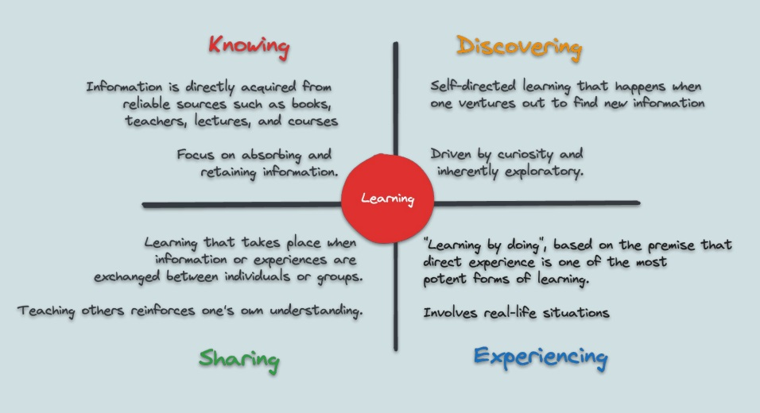

### Prompt Used 

```
I want a new jupyter alike notebook tutorial with a "hands on" approach.

This new tutorial must:
	1. Be beginner friendly.
	2. Be in the likes of the one found on https://networkx.org/documentation/stable/tutorial.html
	3. Be related to the chapters 2, 3, 6, and 7 of the textbook "The Atlas For The Aspiring Network 
	   Scientist" by Michele Coscia, found in https://arxiv.org/pdf/2101.00863
	4. Follow the Learning Methodology described in the picture.
	5. Have a hands on approach, so it must contain bite size exercises (more than 2) throughout the tutorial.

For this new jupyter notebook tutorial, it must be returned to me in a ".ipynb" format.

ensure that: 
	1. all the commands, lessons, and examples are correct and possible.
	2. This is a new tutorial and not a copy of an existing one.

*bonus points for making it fun*
```


### References

- :books: [Coscia, Michele. The Atlas for the Aspiring Network Scientist](https://www.networkatlas.eu/)
- :books: [Tutorial — NetworkX notebook](https://networkx.org/documentation/stable/tutorial.html)

#### Image

<center></center>
