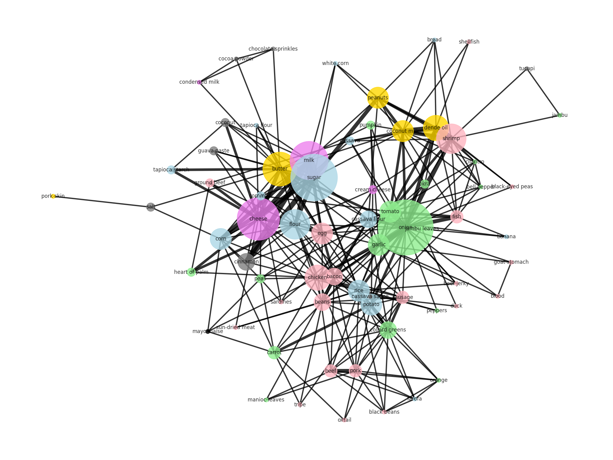

## ARTHUR GAAG - 20230087350

### OBJECTIVE

  

The objectives for this assignment are:
Create a dataset of popular dishes/ingredients and their relations to each other using a LLM.
Construct and manipulate a graph derived from the dataset created in step 1.
Analyze the assortativity of the network.

---

  
### LLM PROMPT

ChatGPT was the LLM of my choosing, for no other reason than it is the one I'm more familiar with.
In order to obtain the .csv files the following prompt was used: 

 
````python

Give me a list of 50 dishes that are popular in Brazil.  
For each dish, provide the dish name, a list of ingredients, and the group each ingredient belongs to (carbohydrate, protein, fat, vegetable, fruit, dairy, condiment, or others).  
  
Organize the information in a CSV file, where each dish is a row with three columns: dish_name, ingredients, and ingredient_type. Ensure that the order of ingredients matches the order of ingredient types. Items within a single cell should be separated by commas.  
  
Next, create a nodes.csv file with three columns: node, ing_type, and instances, where:  
  
node = the ingredient name (one node per unique ingredient, no repetitions),  
ing_type = the group the ingredient belongs to,  
instances = the number of times the ingredient appears across the 50 dishes.  
Finally, create an edges.csv file with three columns: source, target, and instances, where:  
  
source and target = distinct ingredients that appear together in at least one dish,  
instances = how many times those two ingredients appear together across the recipes.  
Remember, a connection between ingredient_1 and ingredient_2 is the same as between ingredient_2 and ingredient_1.

````

As a result of this prompt, [three .csv files](./database) were created.
brazilian_dishes.csv
nodes.csv
edges.csv

---

### GRAPH

The files nodes.csv and edges.csv were imported using Pandas and NetworkX to create image_1.  
In the graph, each node represents a different ingredient. The size of the nodes is proportional to the number of times that specific ingredient appears in the 50 recipes. The colors of the nodes represent the type of ingredient.


<span style="display:inline-block;width:12px;height:12px;background-color:#add8e6;border-radius:2px;margin-right:5px;"></span>carbohydrate,  <span style="display:inline-block;width:12px;height:12px;background-color:#ffb6c1;border-radius:2px;margin-right:5px;"></span>protein,  <span style="display:inline-block;width:12px;height:12px;background-color:#ffd700;border-radius:2px;margin-right:5px;"></span>fat,  <span style="display:inline-block;width:12px;height:12px;background-color:#90ee90;border-radius:2px;margin-right:5px;"></span>vegetable,  <span style="display:inline-block;width:12px;height:12px;background-color:#b22222;border-radius:2px;margin-right:5px;"></span>fruit,  <span style="display:inline-block;width:12px;height:12px;background-color:#ee82ee;border-radius:2px;margin-right:5px;"></span>dairy,  <span style="display:inline-block;width:12px;height:12px;background-color:#add8e6;border-radius:2px;margin-right:5px;"></span> condiment,  <span style="display:inline-block;width:12px;height:12px;background-color:##000000;border-radius:2px;margin-right:5px;"></span>other

the edges show which ingredients are present in recipes together, the weight of the lines are proportional to how many times they are present together in those 50 recipes.

<div  align="center">



</div>

---

  ### ASSORTATIVITY

Assortativity is a way to measure the tendency of nodes with similar attributes to connect to one another. The spectrum of assortativity is [-1, 1], where the closer to one, the more homophilic the network is. The closer to minus one, the more heterophilic the network is. If the number happens to be zero, it is said that the connections between nodes have no tendency.

For this network, the assortativity was calculated with the NetworkX function `nx.attribute_assortativity_coefficient()`, passing the ingredient type as the parameter of comparison. This resulted in a value of approximately -0.0144.

It was expected that this graph would be more heterophilic, since the source of the data is the relationships between ingredients in a dish, and in order to have a sustainable diet, there must be a certain level of variety within each dish. Therefore, the results — although not by much — confirmed that ingredients from one group tend to connect with ingredients from other groups.


---

  

## REFERENCES

  

- [Coscia, Michele. *The Atlas for the Aspiring Network Scientist*](https://www.networkatlas.eu/)

- [NetworkX Documentation](https://networkx.org/documentation/stable/reference/index.html)
