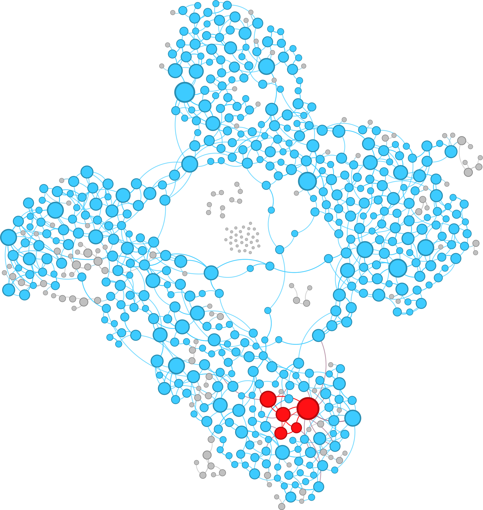

# ARTHUR GAAG  
## 20230087350  
  
## FINAL PROJECT
This final project will have two distinct but sequential parts. For the first part, two lists of nodes and edges, each with their respective attributes, as well as a Python notebook were provided so a complex network could be built. Real world data was used to model this network, but its attributes were stripped of most identifying information to reduce the chance of bias during the initial analysis.
For the second part of this project, a specialist in the field related to the subject of the complex network will provide insight into the scenario it represents. Armed with that knowledge, a new analysis will be conducted.

---
---
## PART ONE

### OBJECTIVE  
The objective for this part is to use [NetworkX](https://networkx.org/documentation/stable/index.html#) and [Gephi](https://gephi.org/) to calculate five different metrics for the network and then create five different graphs, each displaying a different metric. These metrics are: Degree Centrality, Closeness Centrality, Betweenness Centrality, Eigenvector Centrality, and the core of the network and its shell. Additionally, a version of the graph with identified communities will be deployed.

### GEPHI
[Gephi](https://gephi.org/) is an open source software used to manipulate and analyze graphs. It helps create visually appealing graphs through a graphical interface. Because it doesn't require any coding, it makes graph analysis more accessible across different fields.

### METRICS 
When ranking nodes it's tempting to use the degree of a node to decide its importance to the network. Although that strategy is sufficient in some cases, other times a different metric might be more telling.  
  
  #### Degree Centrality:
  - Conveys the same basic idea as degree, which is the number of direct connections a node has.
  - Difference is: that degree centrality normalizes this measurement by dividing it by the maximum possible degree (N-1).
   degree_centrality = $\frac{k}{N-1}$ ; k is the degree.
  #### Closeness Centrality:
   - Takes into account that even if a node is popular (has high degree), it may still be far from many others
   - Measures how close a node is, on average, to all other reachable nodes.
   - For every node it calculates the sum of the shortest distances from that node to every other reachable node, then 
   it divides the number of nodes (N) minus one by this sum.
    closeness_centrality = $\frac{N-1}{\sum_{j\neq i}^{}l_{ij}}$
  #### Betweenness Centrality:
  - A measure of how often a node appears on the shortest paths between pairs of other nodes.
  - Shows how much of a bridging role a node has. So if that node were to be removed, communication between parts of the graph would become significantly more difficult or even impossible. 
  - If the node is bridging large communities, it would have a higher betweenness, since for any communication happen between them it must go through the bridge. 
  
  #### Eigenvector Centrality:
  - Quality of the connection not just quantity. 
  - A node is considered important if it is connected to other important nodes
  
  #### K-core and its shell:
  - The K-core  is the largest subset which every node has at least K connections to other nodes in the K core.
  - The found by recursively removing nodes with less than K connections (k-core decomposition).
  - The k-shell is a subset that contain the nodes removed when decomposing the kcore into k+1core difference of core k-1 and core k. Can be interpreted as the protective layer for the  k-core
  


### GENERATING GRAPH

The files, [nodes](base/GraphTest_nodes.txt) and [edges](base/GraphTest_edges.txt) were provided along with a [python notebook](base/Final_Project.ipynb) to generate a .gexf file that could be opened on Gephi. Since there is no option on the software to generate the k-core and shell, which would be both needed in this project, a couple of changes were made to the original notebook, that resulted in the [main.py](/main.py).
#### The major changes were:
- Removed magical commands
- Calculated the k-core and its shell
- Calculated the number of neighbors
- Calculated closeness centrality
- Appended the three new attributes
- Removed plotting section

All of the modifications above as well as any other are stamped with a "MOD.:" comment on main.py.
After running main it resulted in the gexf file that was imported into Gephi.
### THE GRAPHs GEPHI

When importing the graph the options **undirected** and **don't merge** were selected, because in the notebook
the the type of graph generated was a multigraph and it is undirected and may have multiple edges between a pair of nodes.
With the graph loaded on Gephi, the sizes of the nodes were changed to be proportional to the number of neighbors
each node has. Then a mixture of the layouts "contraction", "expansion", "ForceAtlas", "ForceAtlas 2","OpenOrd" and
"Noverlap" were used to shape the overall layout. With that done, in the statistics section the "modularity" option for
community detection was applied. The colors were changed based on the community and the with the help of the
 ["SigmaExporter"](https://gephi.org/plugins/#/plugin/sigmaexporter) plugin the graph was exported and later [DEPLOYED](https://gaagarthur.github.io/datastructure/U3FP/network).
#### Applying the metrics
The degree centrality, betweenness, and eigenvector were all generated on the same statistics tab. For this group, only the closeness centrality was previously calculated in python. Then the nodes were colored  based on those metrics, colder colors representing lower values and warmer colors higher values, leading to the four graphs.

<div align="center">
    <table>
        <tr>
            <td style="width: 200px; text-align: center;">
                <p style="margin: 0 0 5px 0; text-align: center;">Degree Centrality</p>
                
            </td>
            <td style="width: 200px; text-align: center;">
                <p style="margin: 0 0 5px 0; text-align: center;">Closeness Centrality</p>
                
            </td>
        </tr>
    </table>
    <table>
        <tr>
            <td style="width: 200px; text-align: center;">
                
            </td>
            <td style="width: 200px; text-align: center;">
                
            </td>
        </tr>
    </table>
    <table>
        <tr>
            <td style="width: 200px; text-align: center;">
                <p style="margin: 0 0 5px 0; text-align: center;">Betweenness Centrality</p>
                
            </td>
            <td style="width: 200px; text-align: center;">
                <p style="margin: 0 0 5px 0; text-align: center;">Eigenvector Centrality</p>
                
            </td>
        </tr>
    </table>
    <table>
        <tr>
            <td style="width: 200px; text-align: center;">
                
            </td>
            <td style="width: 200px; text-align: center;">
                
            </td>
        </tr>
    </table>
</div>

The only two metrics left are the K-core and its shell. Because Gephi doesn't have an option to calculate the cores and shells, these metrics were obtained using Python. First, using core_numbers function on the graph it was reveled that there was an 1-core, a 2-core and a 3-core which is the center of the network. Then a new attribute for the nodes was created "coshe" if a nodes belonged to the 3-core it would receive a 1, if it belonged to the 2-shell it would receive a 2 and else it would be zero. On Gephi the only thing left to do was color the nodes by those values. The 3-core is colored red and the 2-shell is in blue.

<div align="center">
  
</div>

### PROBLEMS

Some problems encountered were that NetworkX's implementation of the to calculate the k-core, k-shell and number of cores doesn't work with multigraphs. What had to be done was to make a copy of the multigraph and then convert that copy to a simple graph. since one of the requirements for this project was to make the size of the nodes proportional to the number of neighbors that node had, so once the graph was converted it was just a matter of calling a function to find the degree of every node and that would be equivalent to the nuber of neighbors. Finnally, those proprieties were added to the nodes of the original Graph.

```python
G_simple = nx.Graph(G) #convert to simple graph

if len(G_simple) == 0:
    raise ValueError("G_simple is empty.")


Gc = nx.k_shell(G_simple,3) #calculate 3-core
Gs = nx.k_shell(G_simple, k=2) # calculate the 2-shell
cc = nx.closeness_centrality(G) #calculate closeness

# Add new attributes
for node in G.nodes():
    if node in Gc:
        G.nodes[node]['coshe'] = 1
        
    else:
        G.nodes[node]['coshe'] = 0
    if node in Gs:
        G.nodes[node]['coshe'] = 2

    G.nodes[node]['neig'] = G_simple.degree[node] #calculate # neighbors
    G.nodes[node]['close'] = cc[node]
```
### RUN THE CODE
In order to run the code both the [main.py](/main.py) file and the [base](/base) folder (which contains the lists of nodes and edges) must be in the same directory.

### USE OF LLMs

Both OpenAI's ChatGPT and Google's Gemini were used in the making of this project primarily for editorial support, help with Gephi, and bug fixing.

### REFERENCE

- :books: [Coscia, Michele. The Atlas for the Aspiring Network Scientist](https://www.networkatlas.eu/)